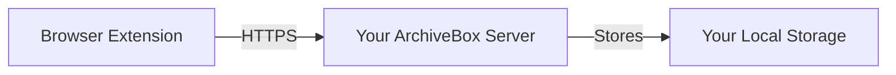

## Overview

The official ArchiveBox Browser Extension enables real-time archiving of web pages directly from your browser. Archive pages as you browse, save selected links, or automatically capture your browsing history.

<Info>
  The extension connects to your self-hosted ArchiveBox instance, keeping you in full control of your archived data.
</Info>

## Installation

### Chrome/Chromium/Brave/Edge

<Steps>
  <Step title="Visit Chrome Web Store">
    Go to the [ArchiveBox Exporter extension](https://chromewebstore.google.com/detail/archivebox-exporter/habonpimjphpdnmcfkaockjnffodikoj)
  </Step>
  
  <Step title="Add to Browser">
    Click **"Add to Chrome"** or **"Add to Brave"**
  </Step>
  
  <Step title="Confirm Installation">
    Click **"Add extension"** in the popup dialog
  </Step>
  
  <Step title="Pin Extension (Optional)">
    Click the puzzle piece icon in your toolbar and pin ArchiveBox for quick access
  </Step>
</Steps>

### Firefox

<Steps>
  <Step title="Visit Firefox Add-ons">
    Go to [Firefox Add-ons](https://addons.mozilla.org/) and search for "ArchiveBox"
  </Step>
  
  <Step title="Add to Firefox">
    Click **"Add to Firefox"**
  </Step>
  
  <Step title="Confirm Permissions">
    Review and accept the requested permissions
  </Step>
</Steps>

<Note>
  You must have a running ArchiveBox instance to use the extension. See [Quickstart](/quickstart) for setup instructions.
</Note>

## Configuration

### Connect to Your ArchiveBox Instance

<Steps>
  <Step title="Open Extension Settings">
    1. Click the ArchiveBox extension icon in your browser toolbar
    2. Click the gear icon or **"Settings"**
  </Step>
  
  <Step title="Enter ArchiveBox URL">
    Enter your ArchiveBox server URL:
    
    ```
    http://localhost:8000
    ```
    
    Or for remote instances:
    ```
    https://archive.yourdomain.com
    ```
  </Step>
  
  <Step title="Test Connection">
    Click **"Test Connection"** to verify it works
  </Step>
  
  <Step title="Save Settings">
    Click **"Save"** to store your configuration
  </Step>
</Steps>

### Authentication

If your ArchiveBox instance requires authentication:

<Tabs>
  <Tab title="Via Extension">
    1. Enter username and password in extension settings
    2. Click **"Login"**
    3. Session will be maintained while browser is open
  </Tab>
  
  <Tab title="Via Browser">
    1. Log in to your ArchiveBox web UI in a regular browser tab
    2. The extension will use the same session cookies
    3. Recommended for better security
  </Tab>
</Tabs>

### Extension Permissions

The extension requests these permissions:

- **Active tab** - Read URL of current page for archiving
- **Storage** - Save your ArchiveBox server URL and preferences
- **Notifications** - Show archive status updates
- **Host permissions** - Connect to your ArchiveBox server

<Info>
  The extension only sends data to YOUR self-hosted ArchiveBox instance. No data is sent to third parties.
</Info>

## Usage

### Archive Current Page

The simplest way to archive:

<Steps>
  <Step title="Navigate to Page">
    Browse to any web page you want to archive
  </Step>
  
  <Step title="Click Extension Icon">
    Click the ArchiveBox icon in your browser toolbar
  </Step>
  
  <Step title="Confirm">
    Click **"Archive This Page"** button
  </Step>
  
  <Step title="Wait for Confirmation">
    A notification will appear when archiving starts
  </Step>
</Steps>

### Archive Selected Links

Archive multiple links from a page:

1. Right-click on a link
2. Select **"Archive with ArchiveBox"** from context menu
3. Link will be queued for archiving

Or:

1. Select multiple links on a page (highlight text containing links)
2. Right-click the selection
3. Choose **"Archive selected links"**
4. All URLs in the selection will be archived

### Keyboard Shortcuts

Set up custom keyboard shortcuts:

<Tabs>
  <Tab title="Chrome/Chromium">
    1. Go to `chrome://extensions/shortcuts`
    2. Find "ArchiveBox Exporter"
    3. Click in the shortcut field
    4. Press your desired key combination (e.g., `Ctrl+Shift+A`)
    5. Click outside the field to save
  </Tab>
  
  <Tab title="Firefox">
    1. Go to `about:addons`
    2. Click the gear icon
    3. Select **"Manage Extension Shortcuts"**
    4. Find ArchiveBox and set your shortcut
  </Tab>
</Tabs>

## Features

### Quick Archive

<CardGroup cols={2}>
  <Card title="One-Click Archive" icon="mouse-pointer">
    Archive the current page with a single click
  </Card>
  
  <Card title="Context Menu" icon="bars">
    Right-click any link to archive it
  </Card>
  
  <Card title="Bulk Archive" icon="layer-group">
    Select and archive multiple links at once
  </Card>
  
  <Card title="Keyboard Shortcuts" icon="keyboard">
    Assign custom hotkeys for quick access
  </Card>
</CardGroup>

### Automatic History Capture

<Warning>
  This feature is experimental and may generate large amounts of data. Use with caution.
</Warning>

Enable automatic archiving of your browsing history:

1. Open extension settings
2. Enable **"Auto-archive browsing history"**
3. Configure:
   - **Frequency** - How often to check history
   - **Filter** - Only archive certain domains
   - **Ignore private browsing** - Skip incognito/private windows
4. Save settings

The extension will periodically:
- Check your browser history
- Find new URLs since last check
- Send them to ArchiveBox
- Track what's been archived

### Tagging

Organize archived pages with tags:

1. Click extension icon
2. Before archiving, enter tags in the **"Tags"** field
3. Separate multiple tags with commas: `blog, tutorial, python`
4. Click **"Archive"**

The snapshot will be tagged in ArchiveBox for easy filtering.

### Status Notifications

The extension shows notifications for:

- ✓ Archive request submitted successfully
- ⚠️ Warning if already archived recently
- ✗ Error if connection fails
- ⏳ Queue status when multiple URLs pending

Click a notification to:
- View the snapshot in ArchiveBox
- See archiving progress
- Retry failed archives

## Advanced Usage

### Custom Depth

Archive a page and its linked pages:

1. Click extension icon
2. Expand **"Advanced Options"**
3. Set **"Depth"**:
   - `0` - Current page only (default)
   - `1` - Current page + all linked pages
   - `2-4` - Continue recursively (use caution!)
4. Click **"Archive"**

<Warning>
  Higher depth values can archive hundreds or thousands of pages. Start with depth=1 and monitor results.
</Warning>

### Persona Selection

Use browser personas for authenticated content:

1. Create persona in ArchiveBox:
   ```bash
   archivebox persona create --import=chrome personal
   ```

2. In extension settings, select **"Persona"**: `personal`

3. Archives will use cookies from that persona

Useful for:
- Paywalled content
- Social media profiles
- Private documents
- Members-only sites

### Extractor Configuration

Choose which archive formats to save:

1. Open extension settings
2. Go to **"Extractors"** tab
3. Enable/disable:
   - Screenshot
   - PDF
   - SingleFile
   - DOM HTML
   - WARC
   - Media (videos/audio)
   - Git clone
4. Save settings

This overrides your server's default configuration for extension-initiated archives.

## Troubleshooting

### Extension Not Connecting

<AccordionGroup>
  <Accordion title="Check ArchiveBox Server" icon="server">
    Verify your ArchiveBox server is running:
    
    ```bash
    # Check server status
    docker compose ps
    # Or
    ps aux | grep archivebox
    ```
    
    Access the web UI manually: http://localhost:8000
  </Accordion>
  
  <Accordion title="Verify URL in Settings" icon="link">
    - Check for typos in server URL
    - Ensure it includes `http://` or `https://`
    - Remove trailing slash
    - Correct: `http://localhost:8000`
    - Incorrect: `localhost:8000/` or `http://localhost:8000/`
  </Accordion>
  
  <Accordion title="Check CORS Settings" icon="shield">
    If your ArchiveBox is on a different domain, enable CORS:
    
    ```bash
    archivebox config --set CORS_ORIGIN_WHITELIST="https://yourdomain.com"
    ```
    
    Restart server after changing.
  </Accordion>
  
  <Accordion title="Test Connection" icon="plug">
    1. Open browser developer tools (F12)
    2. Go to Console tab
    3. Click extension icon
    4. Check for error messages
    5. Look for network errors or CORS issues
  </Accordion>
</AccordionGroup>

### Archives Not Appearing

<Steps>
  <Step title="Check ArchiveBox Logs">
    ```bash
    docker compose logs -f archivebox
    # Or
    tail -f data/logs/errors.log
    ```
  </Step>
  
  <Step title="Verify in Web UI">
    1. Open ArchiveBox web UI
    2. Check recent snapshots
    3. Look for the URL you archived
  </Step>
  
  <Step title="Check Permissions">
    Verify `PUBLIC_ADD_VIEW` is enabled or you're authenticated:
    ```bash
    archivebox config --get PUBLIC_ADD_VIEW
    ```
  </Step>
</Steps>

### High CPU/Memory Usage

If automatic history capture is enabled:

- Reduce check frequency in settings
- Add domain filters to limit scope
- Disable auto-archive and use manual archiving
- Check ArchiveBox server resources

### Browser Slowdown

- Disable unused extension features
- Reduce notification frequency
- Clear extension storage cache
- Check for conflicts with other extensions

## Privacy and Security

### Data Flow

<Info>
  The extension only communicates with YOUR ArchiveBox server. No data is sent to third parties.
</Info>



### What Data is Sent?

When you archive a page, the extension sends:

- Page URL
- (Optional) Tags you specify
- (Optional) Archive depth setting
- (Optional) Persona to use

The extension does NOT send:
- Page content (ArchiveBox fetches it separately)
- Your browsing history (unless auto-archive enabled)
- Personal information
- Cookies (unless using personas)

### Security Best Practices

<AccordionGroup>
  <Accordion title="Use HTTPS" icon="lock">
    Always connect to ArchiveBox over HTTPS when accessing remotely:
    
    ```
    https://archive.yourdomain.com
    ```
    
    Never use HTTP over the public internet.
  </Accordion>
  
  <Accordion title="Enable Authentication" icon="user-lock">
    Require login for your ArchiveBox instance:
    
    ```bash
    archivebox config --set PUBLIC_ADD_VIEW=False
    archivebox manage createsuperuser
    ```
  </Accordion>
  
  <Accordion title="Review Permissions" icon="shield-halved">
    Periodically review what permissions the extension has:
    
    - Chrome: `chrome://extensions`
    - Firefox: `about:addons`
  </Accordion>
  
  <Accordion title="Use Separate Browser Profile" icon="user">
    For sensitive archiving, use a dedicated browser profile:
    
    - Isolates cookies and sessions
    - Prevents accidental archiving of private tabs
    - Better organization
  </Accordion>
</AccordionGroup>

## Source Code

<Info>
  The ArchiveBox Browser Extension is open source!
</Info>

- **Repository**: https://github.com/ArchiveBox/archivebox-browser-extension
- **License**: MIT
- **Contribute**: Issues and PRs welcome

### Building from Source

```bash
# Clone repository
git clone https://github.com/ArchiveBox/archivebox-browser-extension
cd archivebox-browser-extension

# Install dependencies
npm install

# Build extension
npm run build

# Load in browser
# Chrome: chrome://extensions → Load unpacked → select dist/ folder
# Firefox: about:debugging → Load Temporary Add-on → select manifest.json
```

## Alternative: Bookmarklet

If you prefer not to install an extension, use the bookmarklet:

<Steps>
  <Step title="Open ArchiveBox Web UI">
    Navigate to your ArchiveBox admin interface
  </Step>
  
  <Step title="Find Bookmarklet">
    Go to the **"Add URLs"** page
  </Step>
  
  <Step title="Drag to Bookmarks Bar">
    Drag the **"Archive this page"** link to your bookmarks bar
  </Step>
  
  <Step title="Use It">
    Click the bookmark while on any page to archive it
  </Step>
</Steps>

Bookmarklet limitations:
- Less convenient than extension
- No advanced features
- Requires manual clicks
- No automatic history capture

## Next Steps

<CardGroup cols={2}>
  <Card title="CLI Usage" icon="terminal" href="/usage/cli">
    Learn command-line operations
  </Card>
  <Card title="Web UI" icon="browser" href="/usage/web-ui">
    Explore the web interface
  </Card>
  <Card title="Scheduled Archiving" icon="clock" href="/features/scheduled-archiving">
    Automate regular imports
  </Card>
  <Card title="Personas" icon="user" href="/features/personas">
    Archive authenticated content
  </Card>
</CardGroup>